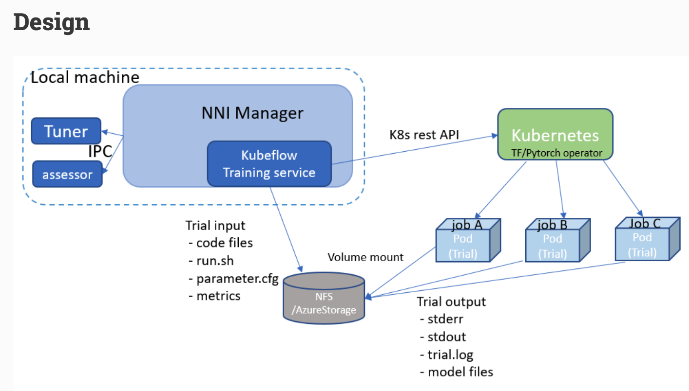

# NNI提交至Kubeflow

## 准备工作

NNI在最新的v1.3中支持了tenserflow operator v1，但是对于pytorch-operator尚未支持v1及以上的版本。所以需要准备tensorflow的训练代码以及相应数据集，并且添加nni的调参部分。

其余准备：

+ K8s集群：官方要求版本在1.8以上，实测在1.15的版本上也可以使用。
+ 安装Kubeflow和tensorflow-operator-v1
+ 需要有分布式存储系统用来储存代码和数据集，以挂载到pod上，只支持NFS和AzureStorage

## config-kubeflow-tf.yml

``` yaml
authorName: default
experimentName: example_tf
trialConcurrency: 1
maxExecDuration: 1h
maxTrialNum: 5
#choice: local, remote, pai, kubeflow
trainingServicePlatform: kubeflow
searchSpacePath: search_space_tf.json
logDir: /home/czh/nni_log_dir
nniManagerIp: 210.28.132.167
#choice: true, false
useAnnotation: false
tuner:
  #choice: TPE, Random, Anneal, Evolution, BatchTuner, MetisTuner, GPTuner
  builtinTunerName: TPE
  classArgs:
    #choice: maximize, minimize
    optimize_mode: maximize
trial:
  codeDir: .
  worker:
    replicas: 1
    command: python3 mnist_tf.py
    gpuNum: 1
    cpuNum: 1
    memoryMB: 8192
    image: msranni/nni:latest
kubeflowConfig:
  operator: tf-operator
  apiVersion: v1
  storage: nfs
  nfs:
    server: 210.28.132.167
    path: /data/nfs/nni_storage
```


## 运行

``` shell
[root@n167 irGdV]# nnictl stop 
INFO: Stoping experiment E0aJzAWk
INFO: Stop experiment success.
[root@n167 irGdV]# nnictl create -c config-kubeflow-tf.yml -p 7777
INFO: expand searchSpacePath: search_space_tf.json to /data/nfs/nni_storage/nni/T5GbO4OE/irGdV/search_space_tf.json 
INFO: expand codeDir: . to /data/nfs/nni_storage/nni/T5GbO4OE/irGdV/. 
INFO: Starting restful server...
INFO: Successfully started Restful server!
INFO: Setting kubeflow config...
INFO: Successfully set kubeflow config!
INFO: Starting experiment...
INFO: Successfully started experiment!
------------------------------------------------------------------------------------
The experiment id is xBAaCvDo
The Web UI urls are: 210.28.132.167:7777
------------------------------------------------------------------------------------

You can use these commands to get more information about the experiment
------------------------------------------------------------------------------------
         commands                       description
1. nnictl experiment show        show the information of experiments
2. nnictl trial ls               list all of trial jobs
3. nnictl top                    monitor the status of running experiments
4. nnictl log stderr             show stderr log content
5. nnictl log stdout             show stdout log content
6. nnictl stop                   stop an experiment
7. nnictl trial kill             kill a trial job by id
8. nnictl --help                 get help information about nnictl
------------------------------------------------------------------------------------
Command reference document https://nni.readthedocs.io/en/latest/Tutorial/Nnictl.html
```


## 实现



+ 任务提交后，NNI Manager(后端)将生成的任务（代码，数据集，启动脚本）储存到NFS的指定位置
+ NNI Manager调用K8s API，创建Pod来运行任务，并将所需的代码数据集等挂载到Pod上