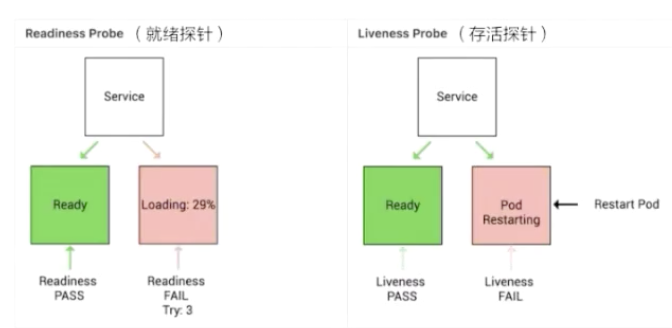
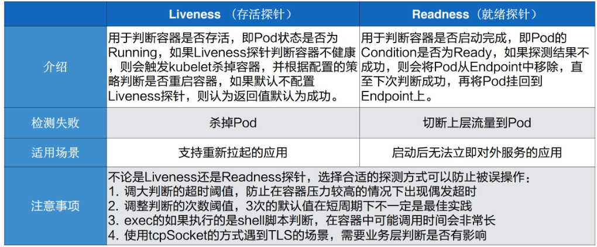

# 可观测性1：应用健康

## 需求来源

+ 应用的状态可以被实时的观测：
  + 应用健康状态
  + 应用资源使用
  + 应用实时日志
+ 应用出现问题时，需要降低影响范围，进行问题调试，诊断
+ 应用出现问题，要用k8s自愈机制来修复

## Readiness和Liveness

就绪探针探测服务是否准备完毕，存活探针探测服务是否可用。

## 使用方式

可以在pod-spec中进行配置

+ 探测方式：
  + httpGET： 通过发送http GET请求，返回200-399的状态码表示应用健康
  + Exec：通过执行命令来检查服务是否正常，命令返回值为0则表示容器健康
  + tcpSocket：通过容器的IP和Port执行TCP检查，建立连接则表示通过检查
+ 探测结果：
  + success：Container通过检查
  + failure：Container未能通过检查
  + unknown：未能执行检查，不采取任何动作
+ 重启策略：
  + Always
  + OnFailure
  + Never
+ 可以通过设置一些参数来对检测进行配置：
  + initialDelaySeconds：Pod启动后延迟多久进行检测
  + periodSeconds： 检测间隔
  + timeoutSeconds：探测的超时时间
  + successThreshold： 探测失败后再次判断成功的阈值
  + failureThreshold： 探测失败的重试次数

## 故障排查

+ Pod停留在Pending：表示调度器备有介入，可以通过describe pod查看事件排查，通常和资源使用相关
+ Pod停留在Waiting：表示Pod的镜像没有正常的拉取，通常可能和私有镜像拉取，镜像地址不存在，镜像公网拉取相关
+ Pod CrashLoopBack：表示Pod已经完成调度并且启动，但是启动失败，通常是由于配置、权限造成，需要查看Pod日志
+ Pod处在Running但是没有正常工作：通常是由于部分字段拼写错误造成，可以通过校验部署来排查，例如：kubectl apply --validate -f pod.yaml
+ Service无法正常工作：排除网络插件自身的问题外，最可能的是label的配置问题

## 应用远程调试

+ 进入Pod：kubectl exec -it pod name -n namespace -- /bin/bash
+ 进入容器：kubectl exec -it pod name -c containername -n namespace -- /bin/bash

+ 当集群中依赖的应用需要本地调试时：可以使用telepresence将本地应用代理到集群的service来调试
+ 当本地开发的应用需要调用集群中的服务时：可以使用port-forward将远程的应用代理到本地的端口上
+ 开源的调试工具 kubectl-debug