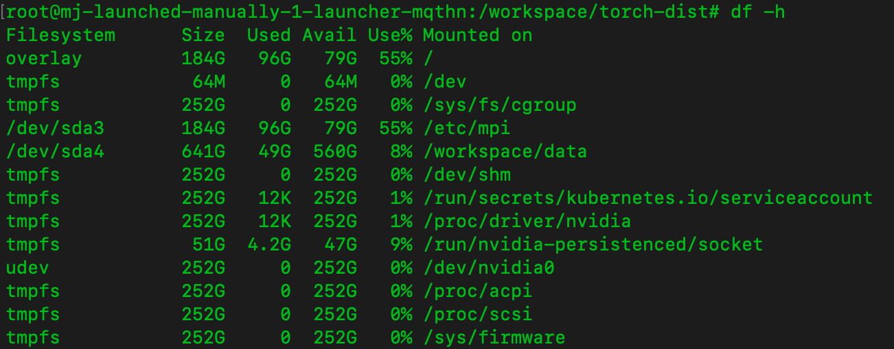

# Dlkit GPU分配比较实验

## 实验准备

由于使用dlkit前端提交的任务可能被调度到n32上，也可能被调度到n33上，所以不好进行比较。实验从后端，通过<code>kubectl apply -f </code>的方式，用YAML文件提交任务。

实验过程中发现，当任务所需的GPU数目超过某个上限时，会报共享内存不足的错误。虽然docker容器可以在启动时通过<code>--shm-size</code>参数来控制容器的共享内存，但是k8s没有提供类似的参数，k8s的容器共享内存默认为64MB。


解决方案是挂载<code>emptyDir</code>类型的数据卷到目录<code>/dev/shm</code>，并将medium设置为Memory

``` yaml
spec:
  volumes:
  - name: dshm
    emptyDir:
      medium: Memory
  containers:
  - image: gcr.io/project/image
    volumeMounts:
      - mountPath: /dev/shm
        name: dshm
```




## 实验过程

对比nvidia.com/gpu和njuics.cn/gpu两种GPU分配方案，设计了6组实验进行比较，以下是6组实验的结果。

#### 第一组：单个任务对比

分别使用两种GPU分配方案，训练VGG19，需要4个GPU

<table>
  <tr>
    <th width='200px'>策略</th>
    <th>得到的GPU</th>
    <th>用时(s)</th>
  </tr>
  <tr>
    <td>nvidia.com/gpu</td>
    <td>3,11,14,15</td>
    <td>831</td>
  </tr>
  <tr>
    <td>njuics.cn/gpu</td>
    <td>3,4,6,7</td>
    <td>830</td>
  </tr>
</table>


#### 第二组： 两个同类任务对比

分别使用两种GPU分配方案，同时训练两个VGG19，每个需要4个GPU

<table>
  <tr>
    <th width='200px'>策略</th>
    <th>得到的GPU</th>
    <th>用时(s)</th>
  </tr>
  <tr>
    <td>nvidia.com/gpu</td>
    <td>
      <li>1,2,7,9</li>
      <li>3,5,11,13</li>
    </td>
    <td>
      <li>834</li>
      <li>835</li>
    </td>
  </tr>
  <tr>
    <td>njuics.cn/gpu</td>
    <td>
      <li>3,4,5,6</li>
      <li>12,13,14,15</li>
    </td>
    <td>
      <li>830</li>
      <li>827</li>
    </td>
  </tr>
</table>


#### 第三组： 三个 同类任务对比

分别使用两种GPU分配方案，同时训练三个VGG19，每个需要4个GPU

<table>
  <tr>
    <th width='200px'>策略</th>
    <th>得到的GPU</th>
    <th>用时(s)</th>
  </tr>
  <tr>
    <td>nvidia.com/gpu</td>
    <td>
      <li>2,4,6,8</li>
      <li>1,7,9,15</li>
      <li>5,10,11,13</li>
    </td>
    <td>
      <li>865</li>
      <li>852</li>
      <li>856</li>
    </td>
  </tr>
  <tr>
    <td>njuics.cn/gpu</td>
    <td>
      <li>3,4,5,6</li>
      <li>12,13,14,15</li>
      <li>8,9,10,11</li>
    </td>
    <td>
      <li>860</li>
      <li>842</li>
      <li>846</li>
    </td>
  </tr>
</table>


#### 第四组： 四个同类任务对比

分别使用两种GPU分配方案，同时训练4个VGG19，每个需要4个GPU

<table>
  <tr>
    <th width='200px'>策略</th>
    <th>得到的GPU</th>
    <th>用时(s)</th>
  </tr>
  <tr>
    <td>nvidia.com/gpu</td>
    <td>
      <li>2,6,9,15</li>
      <li>0,1,8,12</li>
      <li>3,4,5,7</li>
      <li>11,12,13,14</li>
    </td>
    <td>
      <li>872</li>
      <li>862</li>
      <li>855</li>
      <li>854</li>
    </td>
  </tr>
  <tr>
    <td>njuics.cn/gpu</td>
    <td>
      <li>3,4,5,6</li>
      <li>12,13,14,15</li>
      <li>8,9,10,11</li>
      <li>0,1,2,7</li>
    </td>
    <td>
      <li>851</li>
      <li>854</li>
      <li>854</li>
      <li>849</li>
    </td>
  </tr>
</table>


#### 第五组： 6 + 4 + 6

<table>
  <tr>
    <th width='200px'>策略</th>
    <th>得到的GPU</th>
    <th>用时(s)</th>
  </tr>
  <tr>
    <td>nvidia.com/gpu</td>
    <td>
      <li>0,1,3,9,12,15</li>
      <li>6,7,11,13</li>
      <li>2,4,5,8,10,14</li>
    </td>
    <td>
      <li>661</li>
      <li>871</li>
      <li>646</li>
    </td>
  </tr>
  <tr>
    <td>njuics.cn/gpu</td>
    <td>
      <li>0,1,2,3,4,5,6</li>
      <li>12,13,14,15</li>
      <li>4,7,8,9,10,11</li>
    </td>
    <td>
      <li>658</li>
      <li>861</li>
      <li>643</li>
    </td>
  </tr>
</table>


#### 第6组： 6+2+8

<table>
  <tr>
    <th width='200px'>策略</th>
    <th>得到的GPU</th>
    <th>用时(s)</th>
  </tr>
  <tr>
    <td>nvidia.com/gpu</td>
    <td>
      <li>4,7,9,12,14,15</li>
      <li>0,3</li>
      <li>1,2,5,6,8,10,11,13</li>
    </td>
    <td>
      <li>650</li>
      <li>1609</li>
      <li>536</li>
    </td>
  </tr>
  <tr>
    <td>njuics.cn/gpu</td>
    <td>
      <li>0,1,4,5,6,7</li>
      <li>9,10</li>
      <li>2,3,8,11,12,13,14,15</li>
    </td>
    <td>
      <li>659</li>
      <li>1573</li>
      <li>546</li>
    </td>
  </tr>
</table>


