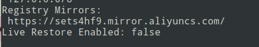
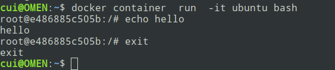
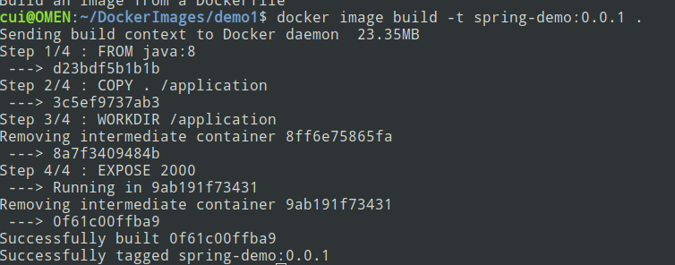
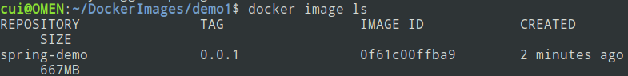
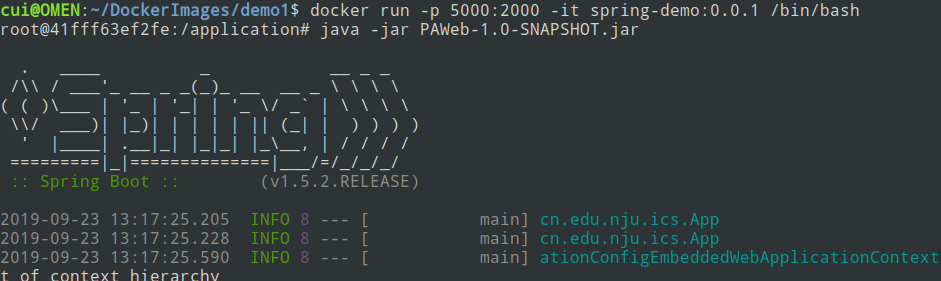
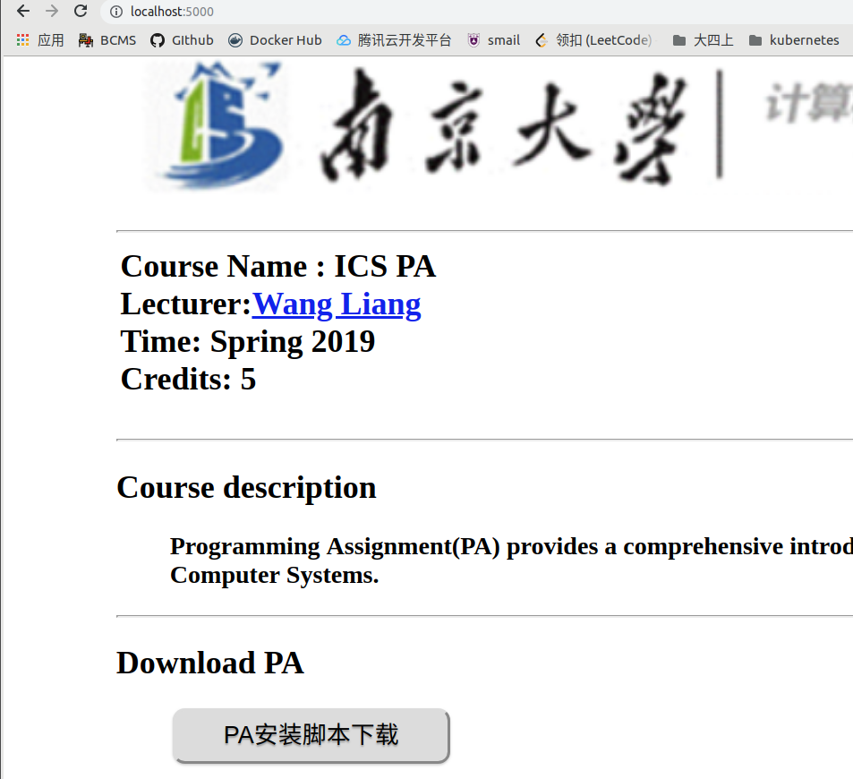
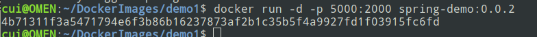
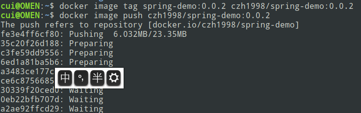
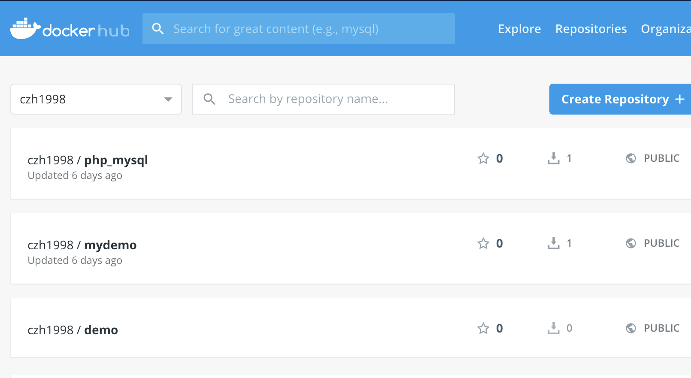

# Docker学习

上周学习了如何搭建kubernetes集群，但是对其中一些概念还是非常模糊。想要理解kubernentes集群的架构，要先从Docker入手，因此这周我学习了Docker的基本使用方法，包括Docker中的一些基本概念，如何运行一个镜像，以及创建并发布一个自己的镜像。

## Docker是什么

### 为什么需要Docker

环境配置是软件开发中的一个比较麻烦的问题，不能保证用户的机器上有软件所依赖的环境，因此经常要带着环境一起发布。**虚拟机**就是一种带环境安装的解决方案，但是有：

1. 占用资源多
2. 冗余步骤多
3. 启动慢
4. 运行慢

等缺点，由于这些缺点，Linux系统中发展出了**Linux容器**这种虚拟化技术。Linux容器的设计思想是：不模拟一个完整的操作系统，而是对进程进行隔离。容器中的进程接触到的资源都是虚拟的，从而将进程运行环境和底层的系统隔离开。**Docker属于对Linux容器的一种封装，提供简单易用的容器使用接口。**Docker将应用程序和所需的依赖打包在一个文件中，运行这个文件就生成了一个虚拟容器，无需担心环境问题。

### Docker中的一些概念

+ 镜像(Image)
+ 容器(Container)
+ 仓库(Repository)

### Docker和kubernetes

由于Docker镜像运行无需关心环境问题，而且轻量级，方便动态扩容和缩容，所以在微服务架构中特别适用。kubernetes是一套对Docker容器进行管理调度的集群管理平台，类似于MapReduce框架，它有一个Master节点和若干个Worker节点。


## 安装Docker

在Ubuntu 18.04系统上安装Docker比较简单

``` shell
cui@OMEN:~$ sudo apt-get install docker.io
[sudo] cui 的密码： 
正在读取软件包列表... 完成
正在分析软件包的依赖关系树       
正在读取状态信息... 完成       
docker.io 已经是最新版 (17.12.1-0ubuntu1)。
升级了 0 个软件包，新安装了 0 个软件包，要卸载 0 个软件包，有 0 个软件包未被升级。
```

安装结束后将当前的用户加入docker用户组，这样就不用在每次运行docker指令时使用sudo。

```shell
cui@OMEN:~$ sudo usermod -aG docker ${USER}
```

docker安装好后，尝试拉取一个官方的Ubuntu镜像，<code>docker container run -it ubuntu bash</code> , 发现速度很慢，使用阿里云的镜像加速服务。注册阿里云账号后，开通镜像加速器服务，执行如下指令：

``` shell
sudo mkdir -p /etc/docker
sudo tee /etc/docker/daemon.json <<-'EOF'
{
  "registry-mirrors": ["https://sets4hf9.mirror.aliyuncs.com"]
}
EOF
sudo systemctl daemon-reload
sudo systemctl restart docker
```

使用<code>docker info</code>查看docker的配置信息



则说明配置成功。

再次拉取并执行Ubuntu的镜像：



其中<code>-it</code>参数指定将IO重定位到当前的终端，如果没有这个选项，容器将在后台运行。


## Docker常用指令

当执行docker run 时，如果本地没有镜像，则会尝试从仓库拉取镜像执行，使用如下语句，可以对本地的镜像进行操作:

```shell
# 列出本地的镜像
$ docker image ls

# 删除本地的镜像
$ docker image rm [imageName]
```


Docker中的镜像运行会自动生成容器，容器本身也是一个文件。

``` shell
# 列出本机正在运行的容器
$ docker container ls

# 列出本机所有容器，包括终止运行的容器
$ docker container ls --all

# 关闭正在运行的容器
$ docker container kill [containID]

# 关闭容器不会删除容器文件，可以使用rm来删除
$ docker container rm [containerID]
```


## 制作自己的Docker镜像

之前当PA助教的时候，用SpringBoot写过一个简单的课程网站。这里我把程序打包成jar包，并指定端口号是2000。接着制作一个Docker镜像，运行镜像就可以直接启动服务。

首先在项目的根目录下创建Dockerfile，写入如下的内容

``` dockerfile
FROM java:8
COPY . /application
WORKDIR /application
EXPOSE 2000
```

含义如下:

+ FROM java:8 ： 该image继承自官方的java镜像，版本号为8.
+ COPY . /application：将当前目录下所有文件（可以使用.dockerignore排除掉一些不需要的文件，和.gitignore类似）,都拷贝进容器中的/application路径。
+ WORKDIR /application ：指定工作目录
+ EXPOSE 2000：将容器的2000端口暴露出来.

然后开始制作镜像：



参数<code>-t</code>指定镜像名称，可以在名称后用冒号来指定版本号，默认为**latest**。 镜像制作好后，可以查看：



发现刚制作好的镜像。运行镜像，成功启动了SpringBoot.





各个参数的含义是:

+ -p 5000:2000  将容器的2000端口映射到本机的5000端口
+ -it：IO重定位到当前shell
+ /bin/bash：容器启动后内部执行的第一条命令

注意到在启动容器后还需要手动执行java -jar来启动服务，我们可以在Dockerfile中，使用CMD参数来启动服务（同时不能在执行docker run时加上参数/bin/bash)



使用了<code>-d</code>参数，让容器在后台运行。还可以使用<code>-rm</code>参数自动清理容器文件。


## 发布自己的镜像

首先注册dockerhub的账号，然后在本地登录

```shell
$ docker login
```

接着为本地的image标注用户名和版本



发布完成后，就可以在dockerhub上看到自己发布的镜像，也可以在别的机器上拉取镜像运行。




## 下一步计划

+ 学习如何写dockerfile，如何定制更多功能的镜像
+ 学习如何在kubernetes集群上运行自己的镜像