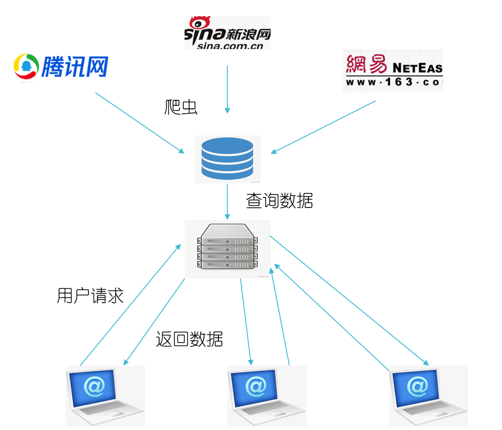
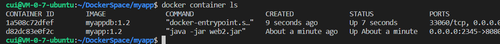
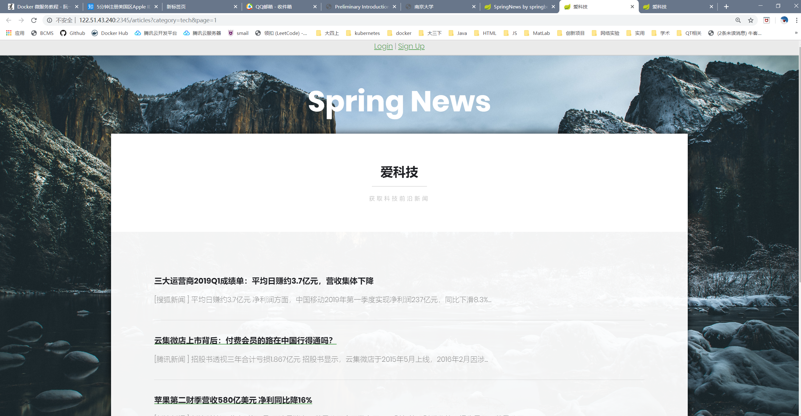
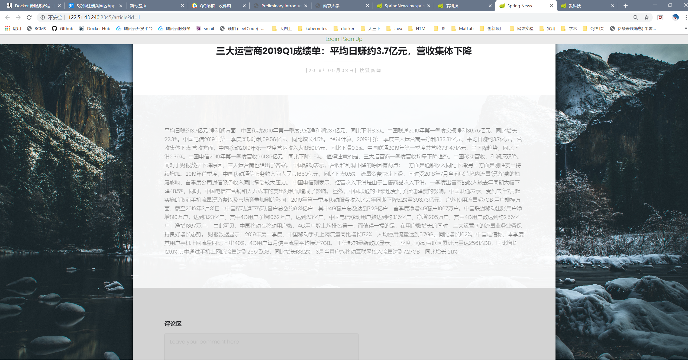

# 使用Docker将服务分解

## 介绍

Docker是提供了虚拟环境的容器工具。站在Docker的角度，软件就是容器的组合。Docker是的软件可以拆分成若干个标准化容器，然后像搭积木一样组合起来。这正是**微服务**的思想：软件把任务外包出去，让各种外部服务完成扯些任务，本身只是底层服务的调度中心和组装层。微服务很适合用Docker容器实现，每个容器承载一个服务。


之前学习了如何构建简单的docker镜像，部署单个镜像的服务，这次来学习如何将一个Web应用程序分解成多个服务，并部署。

## Web应用

之前的课程上写过一个简单的SpringBoot + MySQL的Web应用，基本逻辑是服务器周期性爬取各大门户网站的新闻，并以规定的格式储存到MySQL数据库中。用户可以在前端阅读、评论、点赞，以及注册登录等功能。



其中，后端没有使用数据库框架，直接使用JDBC连接MySQL数据库，通过SQL语句进行操作，算是一个比较简陋的项目。我们把服务分解为**业务容器+数据库容器**两个部分，SpringBoot应用部分用一个镜像构建，MySQL部分用一个镜像构建。

## 测试环境

+ Ubuntu 18.04.1
+ Docker  18.09.7

本来是尝试在虚拟机上测试，但是JDBC似乎不支持192.168.\*.\*网段的数据库的连接，所以是在物理机器上进行实验。

## 构建MySQL镜像并部署

很多常用的环境都有官方的镜像，对于这类环境，可以选择继承官方的镜像，然后进行一些修改。在我的数据库镜像中，需要进行以下工作：

1. 创建需要使用的数据库和用户
2. 创建几个表
3. 在表中插入一些初始的信息，以供测试使用。

#### SQL脚本

将这几项工作的SQL语句写入到SQL文件中：

``` mysql
# initDatabase.sql
set NAMES 'utf8';  
drop database if exists web_db;
create database web_db;
alter database web_db character set utf8;
#上面几步对于编码的设置是需要的，mysql的docker镜像中的默认编码是latin1
create user 'webuser'@'%' identified by 'webuser';
grant all privileges on web_db.* to 'webuser'@'%' with grant option;
use web_db;
# 创建一些表
CREATE TABLE USER....
```

``` mysql
# addSomeData.sql
#插入一些初始新闻供测试用
use web_db;
insert into NEWS values (...), (...) ...
```

现在我们有了两个SQL脚本，只要运行这两个脚本，就可以建立起需要的数据库。

#### Dockerfile

我们在Dockerfile中写入如下内容：

``` dockerfile
FROM mysql:5.7
ENV SCRIPTS /scripts
ENV MYSQL_ROOT_PASSWORD=980120
COPY init.sh /docker-entrypoint-initdb.d
COPY *.sql ${SCRIPTS}/
RUN chmod a+x /docker-entrypoint-initdb.d/init.sh 
```

其中各个字段的含义如下：

+ <code>FROM mysql:5.7 </code> : 该镜像继承自官方的mysql镜像，版本号为5.7

+ <code>ENV SCRIPTS /scripts</code> : 将SCRIPTS 变量设置为路径 /scripts

+ <code>ENV MYSQL_ROOT_PASSWORD=980120</code> : 设置数据库root用户的密码

+ <code>COPY init.sh /docker-entrypoint-initdb.d</code>: 将初始化shell脚本拷贝到/docker-entrypoint-initdb.d下，这个目录下的shell脚本和sql脚本会在运行容器时执行，由于这里我们有两个sql文件，所以用一个shell脚本将其封装，shell脚本的内容如下

  ``` shell
  #!bin/bash
  PWD=980120
  echo "====> auto run mysql scripts..."
  mysql -uroot -p$PWD <<EOF
  source $SCRIPTS/initDatabase.sql;
  source $SCRIPTS/addSomeData.sql;
  EOF
  ```

+ <code>COPY *.sql ${SCRIPTS}/ </code> :将当前目录下的sql文件拷贝到镜像 系统中的指定目录

+ <code>RUN chmod a+x /docker-entrypoint-initdb.d/init.sh </code>: 赋予init.sh执行权限。

#### 打包运行

执行<code>docker build</code>命令

``` shell
cui@VM-0-7-ubuntu:~/DockerSpace/myappdb$ docker build -t myappdb:1.2 .
Sending build context to Docker daemon  17.41kB
Step 1/6 : FROM mysql:5.7
 ---> 383867b75fd2
Step 2/6 : ENV SCRIPTS /scripts
 ---> Using cache
 ---> 7f3ebbaee01b
Step 3/6 : ENV MYSQL_ROOT_PASSWORD=980120
 ---> Using cache
 ---> 9eea5cd5a3c7
Step 4/6 : COPY init.sh /docker-entrypoint-initdb.d
 ---> Using cache
 ---> 6a45b1873b81
Step 5/6 : COPY *.sql ${SCRIPTS}/
 ---> Using cache
 ---> 8d21bcc59fb7
Step 6/6 : RUN chmod a+x /docker-entrypoint-initdb.d/init.sh
 ---> Using cache
 ---> 8b0f4ccc86c4
Successfully built 8b0f4ccc86c4
Successfully tagged myappdb:1.2
```

这里指定版本号为1.2

构建成功后，我们建立容器，运行这个镜像：

``` shell
cui@VM-0-7-ubuntu:~/DockerSpace/myappdb$ docker run --rm -d -p 9999:3306 --name myappdb myappdb:1.2
3519fa0ac2247c24d82a2d690aa2149f762f2fd3ffd57782a02db47cf076475d
```

各个参数的含义:

+ <code>--rm</code> : 容器停止运行后，自动删除容器文件。 这里因为是测试运行。
+ <code>-d</code>:容器后台运行
+ <code>-p 9999:3306</code>:端口映射，容器端口3306映射到本机的9999
+ <code>--name</code>:指定容器的名字，这样在停止容器是就不用去查看container id了。

运行后，会打印出容器的id。尝试用mysql去连接 <本机ip>:9999端口：

``` shell
cui@VM-0-7-ubuntu:~/DockerSpace/myappdb$ mysql -h 122.51.43.240 -P 9999 -u webuser -p
Enter password: 
Welcome to the MySQL monitor.  Commands end with ; or \g.
Your MySQL connection id is 2
Server version: 5.7.27 MySQL Community Server (GPL)

Copyright (c) 2000, 2019, Oracle and/or its affiliates. All rights reserved.

Oracle is a registered trademark of Oracle Corporation and/or its
affiliates. Other names may be trademarks of their respective
owners.

Type 'help;' or '\h' for help. Type '\c' to clear the current input statement.

mysql> 
```

运行正常。可以通过<code>docker container ls</code>查看容器运行情况， <code>docker logs myappdb</code>查看容器的运行日志， <code>docker stop myappdb</code>来停止容器运行。


## SpringBoot容器

这个容器要相对简单，只需要JRE就可以了。修改代码中有关数据库地址，端口，用户名和密码的配置，将代码打包为jar包，然后进行容器的制作。

#### Dockerfile

``` dockerfile
FROM java:8
COPY *.jar /app/
WORKDIR /app
CMD ["java", "-jar", "web.jar"]
```

各个字段的含义在之前有过介绍。

#### 打包运行

执行<code>docker build</code>命令：

``` shell
cui@VM-0-7-ubuntu:~/DockerSpace/myapp$ docker build -t myapp:1.2 .
Sending build context to Docker daemon  66.46MB
Step 1/4 : FROM java:8
 ---> d23bdf5b1b1b
Step 2/4 : COPY *.jar /app/
 ---> Using cache
 ---> f312a5c40339
Step 3/4 : WORKDIR /app
 ---> Using cache
 ---> 90586cfef957
Step 4/4 : CMD ["java", "-jar", "web.jar"]
 ---> Using cache
 ---> 30726c8da622
Successfully built 30726c8da622
Successfully tagged myapp:1.2
```

这里也指定版本号为1.2。

然后建立容器，运行这个镜像:

``` shell
cui@VM-0-7-ubuntu:~/DockerSpace/myapp$ docker run --rm -d --name myapp -p 2345:8080 myapp:1.2
d82dc83e0f2cdf2b9381623bb0163257e7ca2cfb396134997773bbe43704b6dc
```

#### 运行结果

查看两个容器的运行情况：



访问服务器的2345端口：


主页可以正常访问，说明Sping容器运行正常。





新闻页可以访问，两个容器之间的通信正常。

## 总结

下一步尝试用kubenetes来调度多个容器的运行。