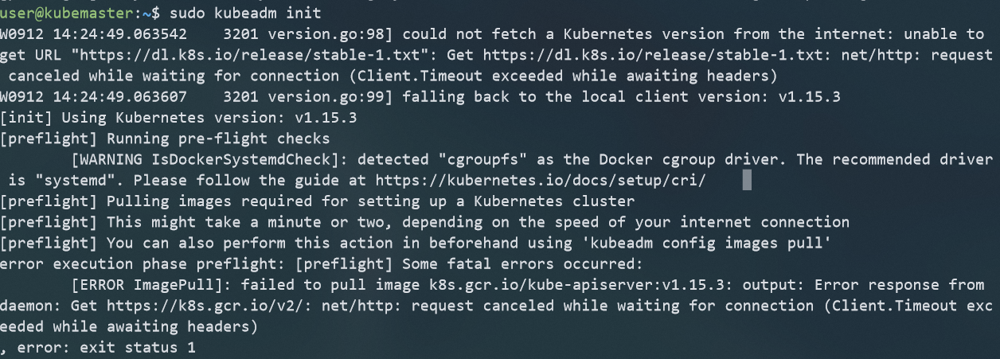
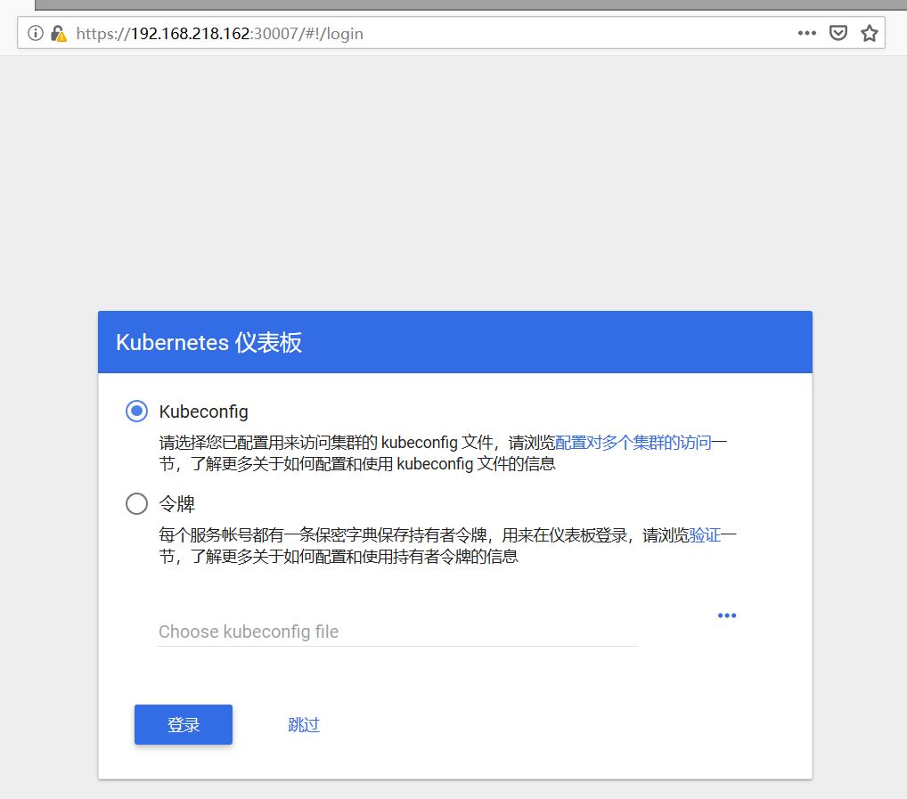

# 使用虚拟机模拟搭建Kubenetes集群

## 准备工作

<table>
    <tr>
        <td>用户名</td>
    	<td>hostname</td>
    	<td>ip地址</td>
    </tr>
	<tr>
        <td>user</td>
        <td>kubemaster</td>
        <td>192.168.202.130</td>
	</tr>
    <tr>
        <td>user</td>
        <td>kubeworker1</td>
        <td>192.168.202.128</td>
	</tr>
	<tr>
        <td>user</td>
        <td>kubeworker2</td>
        <td>192.168.202.129</td>
	</tr>
</table>

+ 系统版本 UbuntuServer 16.04LTS

+ 注意，虚拟机的处理器个数要设置为2个

+ 在每个节点的<code>/etc/hosts</code>文件中上配置好主机名映射

  

  配置好后使用ping来测试主机之间是否可以正常通讯：
  
  

## 节点配置

+ 在每个节点上安装docker

  

+ 将用户加入Docker用户组，然后重启机器或者注销重新登陆

  ``` shell
user@kubemaster:~$ sudo usermod -aG docker $USER
  user@kubemaster:~$ sudo reboot
```
  
+ docker安装测试

  + 登陆docker账户

    

  + 运行hello-world

    

+ 在所有结点上安装Kubernetes组件

  + 软件源配置

    在/etc/apt/source.list.d/路径下创建文件kubernetes.list，写入中科大的镜像地址**deb http://mirrors.ustc.edu.cn/kubernetes/apt kubernetes-xenial main**。然后执行apt-get update

    

  + 软件安装：在每个机器上安装kubernetes组件，注意版本号，选用较为稳定的1.15版本
  
    ``` shell
    # 指定版本为1.15
    sudo apt-get install kubectl=1.15.3-00 kubeadm=1.15.3-00 kubelet=1.15.3-00 -y --allow-unauthenticated
    ```
    
    
    
  + 在所有节点上禁用swap
  
    ``` shell
    sudo swapoff -a
    ```

## 主节点配置

做好准备工作和软件安装的工作后，需要进行主节点的配置。然后再将worker结点加入进去。

+ 使用kubeadm初始化master结点

  

  这里发现初始化失败，是由于初始化时需要从https://k8s.gcr.io.v2拉取镜像，而这个仓库被墙了。查阅文档发现，kubernetes v1.13之后的版本支持在init时通过<code>--image-reposigory</code>

  参数来指定镜像仓库。使用阿里云的镜像仓库进行安装。

  ```shell
  sudo kubeadm init --image-repository registry.aliyuncs.com/google_containers --kubernetes-version v1.15.3 --pod-network-cidr=192.168.0.0/16
  ```

  

  安装成功后，会给出如何将worker结点加入集群的指令，最好将这个指令储存下来。

+ 配置kubectl，使得非root用户也可以使用kubectl

  ```shell
  sudo cp /etc/kubernetes/admin.conf $HOME/
  sudo chown $(id -u):$(id -g) $HOME/admin.conf
  export KUBECONFIG=$HOME/admin.conf
  ```
  
  验证:
  
  
  
+ 配置网络插件

   为了让Pods间可以相互通信，我们必须安装一个网络插件，并且必须在部署任何应用之前安装，**CoreDNS**也是在网络插件安装之后才会启动的。 安装之前，查看pods的状态

  

  可以看到coredns的状态是pending，这是因为没有安装网络插件，通过如下的命令安装网络插件：

  ``` shell
  kubectl apply -f https://docs.projectcalico.org/v3.3/getting-started/kubernetes/installation/hosted/rbac-kdd.yaml
  kubectl apply -f https://docs.projectcalico.org/v3.3/getting-started/kubernetes/installation/hosted/kubernetes-datastore/calico-networking/1.7/calico.yaml
  # 上面的calico.yaml会去quay.io拉取镜像，如果无法拉取，可使用下面的国内镜像
  kubectl apply -f http://mirror.faasx.com/k8s/calico/v3.3.2/rbac-kdd.yaml
  kubectl apply -f http://mirror.faasx.com/k8s/calico/v3.3.2/calico.yaml
  ```

  

  一段时间后，再次查看pods的运行情况:

  

  coredns服务也变为了running，网络插件安装成功。

## 加入Worker节点

在两个woker节点上用**root**用户执行加入指令：

```shell
root$: kubeadm join 192.168.202.130:6443 --token bdy22a.6l18mlolvqmpc9zm --discovery-token-ca-cert-hash sha256:f3a9497faf12ee3dddf0eef44a0c532daf719913d282767d9ebb7e3678ac50bc
```

执行完成后，等待一会，在主节点上执行查看集群中节点的命令可以看到如下的输出：


说明worker结点加入成功。

## 可视化工具(Dash board)安装

Kubernetes Dashboard 是一个管理Kubernetes集群的全功能Web界面，旨在以UI的方式完全替代命令行工具（kubectl 等）。由于该工具的镜像仓库也被墙了，所以使用国内镜像安装，在Master结点上执行：

```shell
kubectl apply -f http://mirror.faasx.com/kubernetes/dashboard/master/src/deploy/recommended/kubernetes-dashboard.yaml
```

安装后查看部署状态：


然后对dash board进行配置，将type从ClusterIP修改为NodePort，之后就可以从**https://<master_ip>:port**访问集群的Web UI了。

```shell
kubectl edit service kubernetes-dashboard -n kube-system
```




### 添加dashboard admin

+ 创建服务账号

  首先创建一个叫 admin-user的服务账号，并放在kube-system的名空间下：

  

  然后执行<code>kubectl create -f admin-user.yaml</code>

+ 绑定角色

  默认情况下，`kubeadm`创建集群时已经创建了`admin`角色，我们直接绑定即可：

  

  执行`kubectl create -f admin-user-role-binding.yaml`命令.

+ 获取Token

  通过`kubectl -n kube-system describe secret $(kubectl -n kube-system get secret | grep admin-user | awk '{print $1}')`获取登录所需的token，登录后就可以查看集群状况。

  


## 后续工作

学习Docker，kubernetes中的一些重要概念和使用方法。