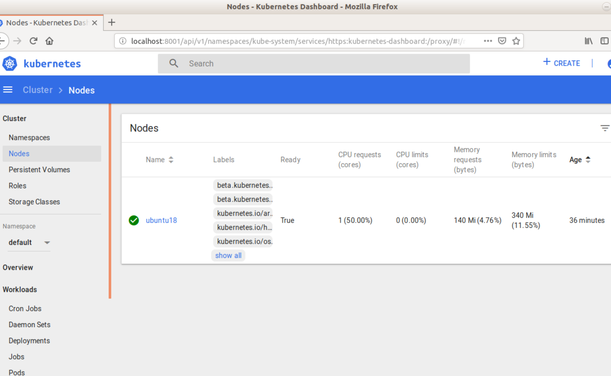

# 使用虚拟机模拟搭建Kubenetes集群

## 准备工作

<table>
    <tr>
        <td>用户名</td>
    	<td>hostname</td>
    	<td>ip地址</td>
    </tr>
	<tr>
        <td>user</td>
        <td>kubemaster</td>
        <td>192.168.218.162</td>
	</tr>
    <tr>
        <td>user</td>
        <td>kubework1</td>
        <td>192.168.218.159</td>
	</tr>
	<tr>
        <td>user</td>
        <td>kubework2</td>
        <td>192.168.218.158</td>
	</tr>
</table>

+ 系统版本 UbuntuServer 16.04LTS

+ 在每个节点上配置好主机名映射

  

  

## 节点配置

+ 在每个节点上安装docker

  

+ docker安装测试

  + 登陆docker账户

    

  + 运行hello-world

    

+ 在所有结点上安装Kubernetes组件

  + 软件源配置

    在/etc/apt/source.list.d/路径下创建文件kubernetes.list，写入中科大的镜像地址**deb http://mirrors.ustc.edu.cn/kubernetes/apt kubernetes-xenial main**。然后执行apt-get update

  + 软件安装

    

## 主节点配置

做好准备工作和软件安装的工作后，需要进行主节点的配置。然后再将worker结点加入进去。

+ 禁用swap

  ``` shell
  sudo swapoff -a
  ```

+ 使用kubeadm初始化master结点

  

  这里发现初始化失败，是由于初始化时需要从https://k8s.gcr.io.v2拉取镜像，而这个仓库被墙了。查阅文档发现，kubernetes v1.13之后的版本支持在init时通过<code>--image-reposigory</code>

  参数来指定镜像仓库。使用阿里云的镜像仓库进行安装。

  ```shell
  sudo kubeadm init --image-repository registry.aliyuncs.com/google_containers --pod-network-cidr=10.244.0.0/16 --apiserver-advertise-address=192.168.218.162
  ```

  

  安装成功后，会给出如何将worker结点加入集群的指令。

+ 配置kubectl

  ```shell
  sudo cp /etc/kubernetes/admin.conf $HOME/
  sudo chown $(id -u):$(id -g) $HOME/admin.conf
  export KUBECONFIG=$HOME/admin.conf
  ```

## 加入Worker节点

在两个woker节点上执行指令：

```shell
sudo kubeadm join 192.168.218.162:6443 --token updefu.hb2b9zomlko91huy --discovery-token-ca-cert-hash sha256:c761c77c26f61fc9065db578c274ff99c0494ab7a3a65a1a8a4d5aa4741fc4ac
```

执行完成后，在主节点上执行查看集群中节点的命令可以看到如下的输出：


说明worker结点加入成功。

## 网络插件配置

将worker节点插入集群之后，在master结点上执行指令：

```shell
sudo kubectl get pods --all-namepsaces
```

可以查看集群上所有的pod，结果如下：


有关coredns的两个pods处于pending状态。需要进行网络插件的安装，这里选择的是calico，安装指令如下：

```shell
kubectl apply -f https://docs.projectcalico.org/v3.1/getting-started/kubernetes/installation/hosted/rbac-kdd.yaml
kubectl apply -f https://docs.projectcalico.org/v3.1/getting-started/kubernetes/installation/hosted/kubernetes-datastore/calico-networking/1.7/calico.yaml
```

网络插件安装完成后偶，再次查看所有pods的运行情况：


所有的pods都是running状态，集群的基本功能搭建完成。

## 可视化工具(Dash board)安装

Kubernetes Dashboard 是一个管理Kubernetes集群的全功能Web界面，旨在以UI的方式完全替代命令行工具（kubectl 等）。由于该工具的镜像仓库也被墙了，所以使用国内镜像安装：

```shell
kubectl apply -f http://mirror.faasx.com/kubernetes/dashboard/master/src/deploy/recommended/kubernetes-dashboard.yaml
```

安装后查看部署状态：


然后对dash board进行配置，将type从ClusterIP修改为NodePort，之后就可以从**https://<master_ip>:port**访问集群的Web UI了。

```shell
kubectl edit service kubernetes-dashboard -n kube-system
```


### 添加dashboard admin

+ 创建服务账号

  首先创建一个叫 admin-user的服务账号，并放在kube-system的名空间下：

  

  然后执行<code>kubectl create -f admin-user.yaml</code>

+ 绑定角色

  默认情况下，`kubeadm`创建集群时已经创建了`admin`角色，我们直接绑定即可：

  

  执行`kubectl create -f admin-user-role-binding.yaml`命令.

+ 获取Token

  通过`kubectl -n kube-system describe secret $(kubectl -n kube-system get secret | grep admin-user | awk '{print $1}')`获取登录所需的token，登录后就可以查看集群状况。

  


## 后续工作

学习Docker，kubernetes中的一些重要概念和使用方法。