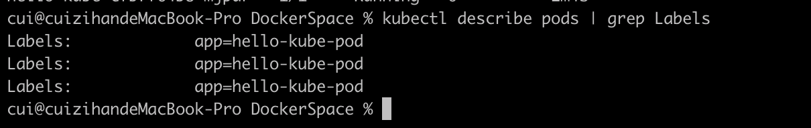

# K8s简单实践

## Kubernetes 重要概念

deployment 控制replicationset，replicationset控制Pod。共同构成了一个服务，向外提供稳定可靠的service。


+ pod： pod是一个逻辑概念，是k8s资源调度的单元，一般会把一组功能强相关的容器逻辑上称之为一个pod。逻辑上，pod表示某种应用的一个实例，比如一个典型的web应用由前端、后端及数据库构建而成，这三个组件运行在各自的container中，我们可以创建包含这3个container的pod。
+ ReplicationSet：简称rs。是pod的复制抽象，用于解决pod的扩容缩容问题。通常，在分布式应用中，为了性能或高可用性的考虑，需要复制多份资源，并且根据负载情况动态伸缩。通过rs，我们可以指定一个应用需要几份复制，当某个pod宕机时，会自动创建新的pod进行替换。以保证有足够的复制。
+ Deployment：Deployment在继承pod和Rs所有特性的同时，他可以实现对template模板进行实时滚动更新。只要在deployment描述想要的目标状态时什么，deployment controller会帮你讲pod和rs的实际状态改变到目标状态。


## Minikube配置

minikube是对kubernetes集群的本地模拟，在kubernetes的学习过程中，可以在minikube上学习kubernetes的常规用法。

先安装kubectl

``` shell
brew install kubectl
```

在Mac os上可以用homebrew来安装minikube，在命令行中运行如下的指令：

``` shell
brew cask install minikube
```

在启动minikube集群之前，要确保机器上拥有可以创建虚拟机的软件，官方给出了三种选择 1、hyperkit 2、virtual box 3、vm fusion。这里我安装了virtual box。

然后初始化minikube，因为在初始化的过程中会拉取国外的镜像，如果没办法科学上网，需要在参数里指出使用国内的镜像仓库。我使用的是阿里云的镜像。**注意**：<code>--registry-mirror</code>指定你的minikube集群使用的镜像加速器地址，xxxxxx部分的内容因人而异。可以开通阿里开发者帐户，再使用阿里的加速服务。登录阿里开发者帐户后，[https://cr.console.aliyun.com/undefined/instances/mirrors](https://links.jianshu.com/go?to=https%3A%2F%2Fcr.console.aliyun.com%2Fundefined%2Finstances%2Fmirrors) 中查看加速器地址。

``` shell
minikube start --image-mirror-country cn \
    --iso-url=https://kubernetes.oss-cn-hangzhou.aliyuncs.com/minikube/iso/minikube-v1.5.0.iso \
    --registry-mirror=https://xxxxxx.mirror.aliyuncs.com
```

初始化集群的过程大约持续10分钟，安装好之后执行<code>minikube kubectl</code>, 然后执行<code>kubectl get service</code>验证是否成功安装：


也可以运行<code>minikube dashboard</code>, 会自动打开集群的dashboard


## 部署一个Pod

首先准备好两个一个docker镜像，这里使用如下两个文件构建docker镜像：

``` js
//hello-kube.js
var http = require('http');

var handleRequest = function(request, response) {
  console.log('Received request for URL: ' + request.url);
  response.writeHead(200);
  response.end('Hello World!');
};
var www = http.createServer(handleRequest);
www.listen(8080);
```

``` dockerfile
# Dockerfile
FROM node:6.14.2
EXPOSE 8080
COPY server.js .
CMD node server.js
```

注意，minikube自带docker引擎，所以我们需要重新配置客户端，让 docker 命令行与 Minikube 中的 Docker 进程通讯：

``` shell
eval $(minikube docker-env)
```

在运行上面的命令后，再运行 `docker image ls` 时只能看到一些 Minikube 自带的镜像，说明目前使用的是minikube自带的docker，然后再构建我们自己的hello-kube镜像。

创建一个pod.yaml文件

``` yaml
apiVersion: v1
kind: Pod
metadata:
  name: hello-kube-demo
spec:
  containers:
    - name: hello-kube
      image: hello-kube:latest
      imagePullPolicy: IfNotPresent
      ports:
        - containerPort: 8080
```

这里指定<code>imagePullPolicy: IfNotPresent</code>, 含义是如果本地不存在镜像，才会去远程拉取。

然后执行

``` shell
kubectl apply -f pod.yaml
```

结果如下：


但是这时我们还不能访问到它的服务，可以理解为pod都运行在kubernetes集群的内网中，要把服务暴露出来才能访问。

## 部署一个Deployment

创建一个文件dep.yaml

``` yaml
apiVersion: apps/v1
kind: Deployment
metadata:
  labels:
    app: hello-kube-dep
  name: hello-kube
spec:
  replicas: 3
  selector:
    matchLabels:
      app: hello-kube-pod
  template:
    metadata:
      labels:
        app: hello-kube-pod
    spec:
      containers:
      - image: hello-kube
        name: hello-kube
        imagePullPolicy: IfNotPresent
        ports:
        - containerPort: 8080
```

这里我们指定了三份复制，然后执行：

``` shell
kubectl apply -f dep.yaml
```


可以看到创建了3个pod。

## 暴露服务

创建一个service定义文件service.yaml

``` yaml
apiVersion: v1
kind: Service
metadata:
  name: hello-kube-demo-svc
  labels:
    app: hello-kube
spec:
  type: NodePort
  ports:
    - port: 8080
      nodePort: 30001
  selector:
    app: hello-kube-pod
```


在最后两行我们指定了请求会被发向集群中的哪些pod，使用app为hello-kube-pod来进行筛选，我们之前在dep.yaml中指定了pod的app，可以查看集群中所有pod的label



我们指定了把容器的 8080 端口从 node 的 30001 端口暴露出来。然后执行<code>minikube service hello-kube-demo-svc --url</code>,	就可以看到暴露出来的IP地址,，通过该地址就可以访问服务。


## 清理

``` shell
cui@cuizihandeMacBook-Pro DockerSpace % kubectl delete service hello-kube-demo-svc
service "hello-kube-demo-svc" deleted
cui@cuizihandeMacBook-Pro DockerSpace % kubectl delete deployment hello-kube
deployment.apps "hello-kube" deleted
```

